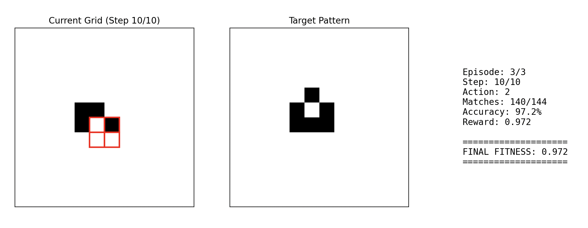

# Reinforcement Learning Gym Environment for a Pattern Matching Game in Conway's "Game of Life"

A Gymnasium-compatible environment for training RL agents to create action sequences that lead to constructing a target pattern in a cellular environment that updates according to Conway's "Game of Life".

## Game Instructions - Pattern Matching in Conway's "Game of Life"
• Goal: Match Target Pattern at step 10  
• Actions (Keyboard Shortcuts for Manual Play):  

- Arrow Keys: MOVE 2x2 write window Up, Down, Left, or Right  
- Space Bar: PASS  
- Hex Keys(0-9 & A-F): WRITE a 2×2 pattern 

• Update Rule: An action (i.e. move, pass, or write) is always preceded by a "Game of Life" update step.   



## Python UV Environment Installation

```bash
uv pip install .
```

## Quick Start

### 1. Test with random policy
```bash
python test_env.py --mode random --episodes 5 --render
```

### 2. Test with greedy heuristic
```bash
uv run test_env.py --mode greedy --episodes 3 --render
```

### 3. Manual game play!
```bash
uv run test_env.py --mode manual
```

## Using the Environment in Your RL Code

```python
import gymnasium as gym
import rl_GoL_env_gym  # Registers "GoL-2x2-v0"

# Create environment
env = gym.make("GoL-2x2-v0", grid_size=12, max_steps=10)

# Training loop
obs, info = env.reset()
target = info['target']  # The pattern to match

for episode in range(num_episodes):
    obs, info = env.reset()
    terminated = False
    truncated = False
    
    while not (terminated or truncated):
        # Your agent selects action (0-20)
        action = agent.select_action(obs)
        
        # Environment step
        obs, reward, terminated, truncated, info = env.step(action)
        
        # reward is 0.0 until step 10, then it's the match percentage
        if terminated:
            print(f"Match accuracy: {info['accuracy']:.2%}")

env.close()
```

## Evolutionary Algorithms (alternative exploration)
Alternatively, to play the game in the browser and experiment with Evolutionary Algorithms for mutating action sequences to find a good solution, check out https://evolutionary-ca-webgpu.onrender.com/

## Environment Details

### Observation Space
- **Shape**: `(12, 12, 2)` with dtype `int8`
- **Channel 0**: Current Game of Life grid (0=dead, 1=alive)
- **Channel 1**: Write head position mask (1 for the 2×2 write area)

### Action Space
- **Type**: `Discrete(21)`
- Actions:
  - `0`: Move head up
  - `1`: Move head down
  - `2`: Move head left
  - `3`: Move head right
  - `4`: Pass (do nothing)
  - `5-20`: Write patterns 0x0 to 0xF as 2×2 grids

Pattern encoding (4 bits → 2×2 grid):
```
bit 0 = top-left
bit 1 = top-right
bit 2 = bottom-left
bit 3 = bottom-right
```

### Reward Structure
- **Steps 0-9**: `reward = 0.0`
- **Step 10 (terminal)**: `reward = matching_cells / total_cells`
  - Range: [0.0, 1.0]
  - 1.0 = perfect match

### Episode Flow
1. Environment resets with empty grid and random target pattern
2. Each step:
   - Game of Life update is applied **first**
   - Then the agent's action is executed
3. Episode terminates after 10 steps
4. Final reward based on match percentage

## Architecture Notes

### Key Differences from Standard Gym
1. Uses **Gymnasium** (modern fork of OpenAI Gym)
2. Returns 5-tuple: `(obs, reward, terminated, truncated, info)`


## Example RL Training Integration

### PyTorch Example
```python
import torch
import torch.nn as nn
import gymnasium as gym
import rl_GoL_env_gym

class GoLPolicy(nn.Module):
    def __init__(self):
        super().__init__()
        self.conv1 = nn.Conv2d(2, 32, 3, padding=1)
        self.conv2 = nn.Conv2d(32, 64, 3, padding=1)
        self.fc1 = nn.Linear(64 * 12 * 12, 128)
        self.fc2 = nn.Linear(128, 21)
    
    def forward(self, x):
        # x shape: (batch, 12, 12, 2) -> (batch, 2, 12, 12)
        x = x.permute(0, 3, 1, 2)
        x = torch.relu(self.conv1(x))
        x = torch.relu(self.conv2(x))
        x = x.flatten(1)
        x = torch.relu(self.fc1(x))
        return self.fc2(x)

env = gym.make("GoL-2x2-v0")
policy = GoLPolicy()
optimizer = torch.optim.Adam(policy.parameters())

# Your RL training loop here...
```

### Stable-Baselines3 Example
```python
from stable_baselines3 import PPO
from stable_baselines3.common.env_util import make_vec_env
import rl_GoL_env_gym

# Create vectorized environment
env = make_vec_env("GoL-2x2-v0", n_envs=4)

# Train with PPO
model = PPO("MlpPolicy", env, verbose=1)
model.learn(total_timesteps=100000)

# Evaluate
obs = env.reset()
for _ in range(10):
    action, _ = model.predict(obs)
    obs, reward, done, info = env.step(action)
```

## Utility: Generating Achievable Target Patterns

Instead of using random target patterns, we can generate patterns that are actually achievable within N steps:

```bash
# Generate all unique, reachable patterns in 6 steps
uv run python generate_target_patterns.py --num-steps 6
```

## Files

- `rl_GoL_env_gym.py` - Main Gymnasium environment
- `test_env.py` - Testing and visualization scripts
- 
-

New Code, bad formatting:

Reinforcement Learning Gym Environment for a Pattern Matching Game in Conway's "Game of Life"A Gymnasium-compatible environment for training RL agents to create action sequences that lead to constructing a target pattern in a cellular environment that updates according to Conway's "Game of Life".Game Instructions - Pattern Matching in Conway's "Game of Life"• Goal: Match Target Pattern at step 10• Actions (Keyboard Shortcuts for Manual Play):Arrow Keys: MOVE 2x2 write window Up, Down, Left, or RightSpace Bar: PASSHex Keys(0-9 & A-F): WRITE a 2×2 pattern• Update Rule: An action (i.e. move, pass, or write) is always preceded by a "Game of Life" update step.Python UV Environment Installationuv pip install .
Quick Start1. Test with random policypython test_env.py --mode random --episodes 5 --render
2. Test with greedy heuristicuv run test_env.py --mode greedy --episodes 3 --render
3. Manual game play!uv run test_env.py --mode manual
Using the Environment in Your RL Codeimport gymnasium as gym
import rl_GoL_env_gym  # Registers "GoL-2x2-v0"

# Create environment
env = gym.make("GoL-2x2-v0", grid_size=12, max_steps=10)

# Training loop
obs, info = env.reset()
target = info['target']  # The pattern to match

for episode in range(num_episodes):
    obs, info = env.reset()
    terminated = False
    truncated = False
    
    while not (terminated or truncated):
        # Your agent selects action (0-20)
        action = agent.select_action(obs)
        
        # Environment step
        obs, reward, terminated, truncated, info = env.step(action)
        
        # reward is 0.0 until step 10, then it's the match percentage
        if terminated:
            print(f"Match accuracy: {info['accuracy']:.2%}")

env.close()
Evolutionary Algorithms (alternative exploration)Alternatively, to play the game in the browser and experiment with Evolutionary Algorithms for mutating action sequences to find a good solution, check out https://evolutionary-ca-webgpu.onrender.com/Environment DetailsObservation SpaceType: Dict"grid" (image): Box(0.0, 1.0, (12, 12, 2), float32)Channel 0: Current Game of Life grid (0.0 or 1.0)Channel 1: Write head position mask (0.0 or 1.0)"time" (scalar): Box(0, 10, (1,), int8)Exact number of steps remaining. (e.g., 10 at step 0, 1 at step 9).Action SpaceType: Discrete(21)Actions:0: Move head up1: Move head down2: Move head left3: Move head right4: Pass (do nothing)5-20: Write patterns 0x0 to 0xF as 2×2 gridsPattern encoding (4 bits → 2×2 grid):bit 0 = top-left
bit 1 = top-right
bit 2 = bottom-left
bit 3 = bottom-right
Reward StructureSteps 0-9: reward = 0.0Step 10 (terminal): reward = matching_cells / total_cellsRange: [0.0, 1.0]1.0 = perfect matchEpisode FlowEnvironment resets with empty grid and random target patternEach step:Game of Life update is applied firstThen the agent's action is executedEpisode terminates after 10 stepsFinal reward based on match percentageArchitecture NotesKey Differences from Standard GymUses Gymnasium (modern fork of OpenAI Gym)Returns 5-tuple: (obs, reward, terminated, truncated, info)Example RL Training IntegrationPyTorch Exampleimport torch
import torch.nn as nn
import gymnasium as gym
import rl_GoL_env_gym

class GoLPolicy(nn.Module):
    def __init__(self):
        super().__init__()
        # Grid processing (CNN)
        # Input channels = 2 (grid, head)
        self.conv1 = nn.Conv2d(2, 32, 3, padding=1)
        self.conv2 = nn.Conv2d(32, 64, 3, padding=1)
        
        # Combined features processing (MLP)
        # Input features: (flattened CNN output) + 1 (for time)
        self.fc1 = nn.Linear((64 * 12 * 12) + 1, 128)
        self.fc2 = nn.Linear(128, 21)
    
    def forward(self, obs_dict):
        # Obs_dict contains 'grid' and 'time'
        # x_grid shape: (batch, 12, 12, 2)
        # x_time shape: (batch, 1) [dtype=torch.int8 or torch.int64]
        x_grid = obs_dict['grid']
        x_time = obs_dict['time']
        
        # Process grid
        # (batch, 12, 12, 2) -> (batch, 2, 12, 12)
        x_grid = x_grid.permute(0, 3, 1, 2) 
        x_grid = torch.relu(self.conv1(x_grid))
        x_grid = torch.relu(self.conv2(x_grid))
        x_grid = x_grid.flatten(1) # -> (batch, 64 * 12 * 12)
        
        # Combine flattened grid features with time
        # MODIFICATION: Cast time to float before concatenating
        x_combined = torch.cat([x_grid, x_time.float()], dim=1)
        
        # Process combined features
        x = torch.relu(self.fc1(x_combined))
        return self.fc2(x)

env = gym.make("GoL-2x2-v0")
policy = GoLPolicy()
optimizer = torch.optim.Adam(policy.parameters())

# Your RL training loop here...
# Note: When sampling, you'll need to pass obs as {'grid': obs_grid, 'time': obs_time}
Stable-Baselines3 Examplefrom stable_baselines3 import PPO
from stable_baselines3.common.env_util import make_vec_env
import rl_GoL_env_gym

# Create vectorized environment
# make_vec_env will automatically wrap the env with VecTransposeImage
# which works on Dict spaces, transposing the 'grid' key.
env = make_vec_env("GoL-2x2-v0", n_envs=4)

# Train with PPO
# **IMPROVEMENT**: Use "MultiInputPolicy" for Dict observation spaces
model = PPO("MultiInputPolicy", env, verbose=1)
model.learn(total_timesteps=100000)

# Evaluate
obs = env.reset()
for _ in range(10):
    action, _ = model.predict(obs, deterministic=True)
    obs, reward, done, info = env.step(action)
Utility: Generating Achievable Target PatternsInstead of using random target patterns, we can generate patterns that are actually achievable within N steps:# Generate all unique, reachable patterns in 6 steps
uv run python generate_target_patterns.py --num-steps 6
Filesrl_GoL_env_gym.py - Main Gymnasium environmenttest_env.py - Testing and visualization scriptsgenerate_target_patterns.py - Utility to create achievable target patternstarget_patterns.json - (Example) Output file from generate_target_patterns.py