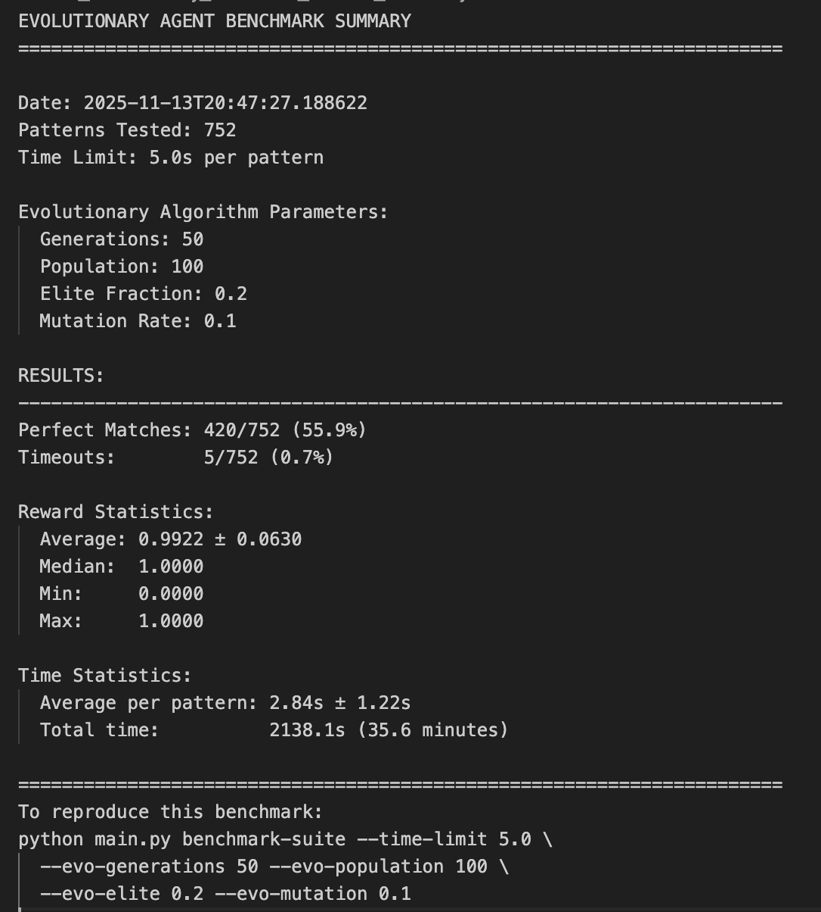

# Reinforcement Learning Gymnasium Environment 🤖🏋🏻
# Pattern Matching in Conway's "Game of Life Game"

This Repository has

1) A Gymnasium-compatible environment for training an RL agent to construct a target patterns in a cellular automaton grid environment that updates according to Conway's "[Game of Life](https://en.wikipedia.org/wiki/Conway%27s_Game_of_Life)" rules.

2) An Evolutionary Search Agent that uses a few seconds of test-time compute to search for a solution


## Game Overview

**Objective**: Create the target pattern in the 12x12 grid after exactly 10 time steps, where each step consists of a [Game of Life](https://en.wikipedia.org/wiki/Conway%27s_Game_of_Life) update step followed by an agent action.

**Core Mechanics**:
- Controls: The user/agent controls a 2×2 "write head" that can move around the Game of Life grid and write patterns
- Each Step: 1) First, The Game of Life updates one step → 2) Then, the user/agent action is taken (i.e. Move, Write, or Pass)
- Final Reward: A percentage based on how well the resulting grid matches the target pattern after the final step

**Actions** (Manual play keyboard shortcuts):
- **Arrow Keys**: Move 2×2 write head (Up/Down/Left/Right)
- **Space Bar**: Pass (do nothing... after the GoL update step)
- **0-9, A-F**: Write one of 16 possible 2×2 patterns (hex encoding)

## Installation

```bash
uv pip install .
```

## Quick Start

### 1. Test Built-in Policies

```bash
# Random policy (baseline) (using uv for Python environment management)
uv run main.py test --mode random --episodes 7 --render

# Greedy policy (smarter baseline)
python main.py test --mode greedy --episodes 5 --render

# Manual control (play yourself!)
python main.py test --mode manual
```

### 2. Train and Evaluate Your Own Agent

#### Simple RL Agent (Placeholder)
```bash
# Train simple agent (replace SimpleAgent class with your RL implementation)
python main.py train --agent-type simple --episodes 100 --render

# Evaluate your trained agent
python main.py eval --agent-type simple --load-path agent.pth --episodes 10 --render

# Evaluate with strict time limit
python main.py eval --agent-type simple --load-path agent.pth --episodes 10 --time-limit 5 --render
```

### Implement Your Own Agent

To use your own RL algorithm, replace the `SimpleAgent` class in `main.py` with your implementation. 

#### Required interface:

```python
class YourAgent:
    def __init__(self, action_space):
        # Initialize your model
        pass
    
    def select_action(self, obs: dict) -> int:
        # Return action index (0-20)
        # Called once per timestep
        pass
    
    def save(self, path: str):
        # Save model weights/parameters
        pass
    
    def load(self, path: str):
        # Load model weights/parameters
        pass
```

The training and evaluation infrastructure handles everything else (environment setup, episode loops, rendering, metrics, time limits).

### Example: Adding an RL Algorithm

```python
class DQNAgent:
    def __init__(self, action_space):
        self.action_space = action_space
        self.q_network = self._build_network()
        self.optimizer = torch.optim.Adam(self.q_network.parameters())
        # ... your implementation
    
    def select_action(self, obs: dict) -> int:
        # Convert observation dict to tensor
        state_tensor = self._obs_to_tensor(obs)
        # Get Q-values and select action
        with torch.no_grad():
            q_values = self.q_network(state_tensor)
        return q_values.argmax().item()
    
    def save(self, path: str):
        torch.save(self.q_network.state_dict(), path)
    
    def load(self, path: str):
        self.q_network.load_state_dict(torch.load(path))
```

## 3. Compare Results with an Evolutionary Search Agent (Built-in)

```bash
# Run Evolutionary Search Agent 
python main.py eval --agent-type evolutionary --episodes 5 --render

# Customize Evolutionary Search Agent Parameters
python main.py eval --agent-type evolutionary --episodes 5 --render --evo-generations 100 --evo-population 200 --evo-elite 0.3 --evo-mutation 0.15

# Test with time limit (will timeout if evolutionary search takes too long)
python main.py eval --agent-type evolutionary --episodes 5 --time-limit 4 --render
```

**Note on Evolutionary Agents**: 
The EvolutionarySearchAgent gets its first observation, which includes the target pattern, and then spends the next few seconds searching for a good action sequence solution. It then takes the best solution it found through an evolutionary process of mutating action sequences with good "fitness", and quickly plays this action sequence in the game. 

There's no training phase - it's pure search. And environment observation is not needed to learn a fit action sequence. 

Training and "memory" could be added by saving seen GoL patterns and their associated action sequences. Then when presented with a new target pattern, the 'agent' could look for similar patterns it has seen and use these as a starting point for more evolutionary search.

## Evolutionary Algorithm Website

For a browser-based experience, check out: https://evolutionary-ca-webgpu.onrender.com/


## Evolutionary Search Agent Benchmark

#
#

# Environment Specification

### Observation Space

**Type**: `Dict` with the following keys:

| Key | Shape | Type | Description |
|-----|-------|------|-------------|
| `grid` | `(12, 12)` | `int8` | Current Game of Life grid (0=dead, 1=alive) |
| `target` | `(12, 12)` | `int8` | Target pattern to match (0=dead, 1=alive) |
| `head_mask` | `(12, 12)` | `int8` | Write head position (1 marks the 2×2 area) |
| `remaining_steps` | `(1,)` | `int32` | Steps remaining in episode |

### Action Space

**Type**: `Discrete(21)`

| Action | Description |
|--------|-------------|
| 0 | Move head up |
| 1 | Move head down |
| 2 | Move head left |
| 3 | Move head right |
| 4 | Pass (do nothing) |
| 5-20 | Write pattern 0x0 to 0xF |

**Pattern Encoding**: 4-bit patterns map to 2×2 grids:
```
bit 0 = top-left    bit 1 = top-right
bit 2 = bottom-left bit 3 = bottom-right

Example: 0x9 = 0b1001 = ■ □
                        □ ■
```

### Sparse Reward Structure

- **Steps 0-9**: `reward = 0.0` 
- **Step 10** (terminal): `reward = matching_cells / total_cells`
  - Range: `[0.0, 1.0]`
  - `1.0` = perfect match

### Episode Dynamics

1. **Reset**: Grid initialized to all dead cells; random target pattern loaded from `target_patterns.json`
2. **Each step**:
   - Game of Life update applied to grid
   - Agent action executed
3. **Termination**: After 10 steps, final reward computed based on pattern match

## Utility: Generating Achievable Target Patterns 

By default, the environment initialization samples from patterns in `target_patterns.json`. To generate new patterns in this file that are provably achievable within N steps run the code below. The current json file contains all 752 unique patterns achievable in 4 action steps, and the code below, which will take approximate 21^2 times longer to run, will generate a json file that has all unique patterns achievable in 6 steps (starting from a blank Game of Life grid):

```bash
python generate_target_patterns.py --num-steps 6
```

## Command Line Reference

### Test Mode (For Exploration, Not Training Evaluation 'Tests')
```bash
python main.py test --mode {random|greedy|manual} [options]

Options:
  --episodes N     Number of episodes (default: 5)
  --render         Enable visualization
```

### Train Mode (Note: Evolutionary Search Agent doesn't need training)
```bash
python main.py train --agent-type {simple|evolutionary} [options]

Options:
  --episodes N            Number of episodes (default: 100)
  --save-path PATH        Save location (default: agent.pth or agent.json)
  --render                Enable visualization
  
Evolutionary agent options:
  --evo-generations N     Generations per episode (default: 50)
  --evo-population N      Population size (default: 100)
  --evo-elite FRAC        Elite fraction (default: 0.2)
  --evo-mutation RATE     Mutation rate (default: 0.1)
```

### Eval Mode
```bash
python main.py eval --agent-type {simple|evolutionary} [options]

Options:
  --load-path PATH        Agent to load (default: agent.pth or agent.json)
  --episodes N            Number of episodes (default: 10)
  --render                Enable visualization
  --time-limit SECONDS    Per-episode time limit (default: 30.0)
  
Evolutionary agent options:
  --evo-generations N     Generations per episode (default: 50)
  --evo-population N      Population size (default: 100)
  --evo-elite FRAC        Elite fraction (default: 0.2)
  --evo-mutation RATE     Mutation rate (default: 0.1)
```

### Evolutionary Search Agent - Benchmark Suite Mode 
```bash
python main.py benchmark-suite [options]

Options:
  --time-limit SECONDS    Per-episode time limit (default: 5.0)
  --render                Enable visualization 
  
Evolutionary agent options:
  --evo-generations N     Generations per episode (default: 50)
  --evo-population N      Population size (default: 100)
  --evo-elite FRAC        Elite fraction (default: 0.2)
  --evo-mutation RATE     Mutation rate (default: 0.1)
```

### Benchmark Suite Mode

Runs an Evolutionary Search Agent on **every pattern** in `target_patterns.json` with a 5-second test-time compute limit for each pattern/game. See [video](https://vimeo.com/1136735348).

**Basic usage:**
```bash
python main.py benchmark-suite
```

**With custom evolutionary parameters:**
```bash
python main.py benchmark-suite --time-limit 4.0 \
  --evo-generations 100 --evo-population 200 \
  --evo-elite 0.3 --evo-mutation 0.15
```

**With visual rendering:**
```bash
python main.py benchmark-suite --time-limit 5.0 --render
```

**Output Files**

Creates two files with timestamps:

1. **JSON file** (`benchmark_evolutionary_TIMESTAMP.json`):
   - Complete results for each pattern
   - Summary statistics
   - All parameters used
   - Machine-readable for analysis

2. **Summary file** (`benchmark_evolutionary_TIMESTAMP_summary.txt`):
   - Human-readable overview
   - Key statistics (perfect matches, timeouts, avg reward, etc.)
   - Command to reproduce the benchmark

**Statistics Tracked**
- Perfect match rate 
- Timeout rate 
- Reward statistics (mean, std, median, min, max)
- Time statistics (mean, std, total)
- Per-pattern details


## Citation

If you use this environment in your research, please cite:

```bibtex
@misc{gol_pattern_matching_env,
  author = {Khanlian, Jon},
  title = {Conway's Game of Life Pattern Matching RL Environment},
  year = {2025},
  publisher = {GitHub},
  url = {https://github.com/Digital-Physics/game-of-life-pattern-RL-gym}
}
```

## 📜 License

This project is licensed under the MIT License.